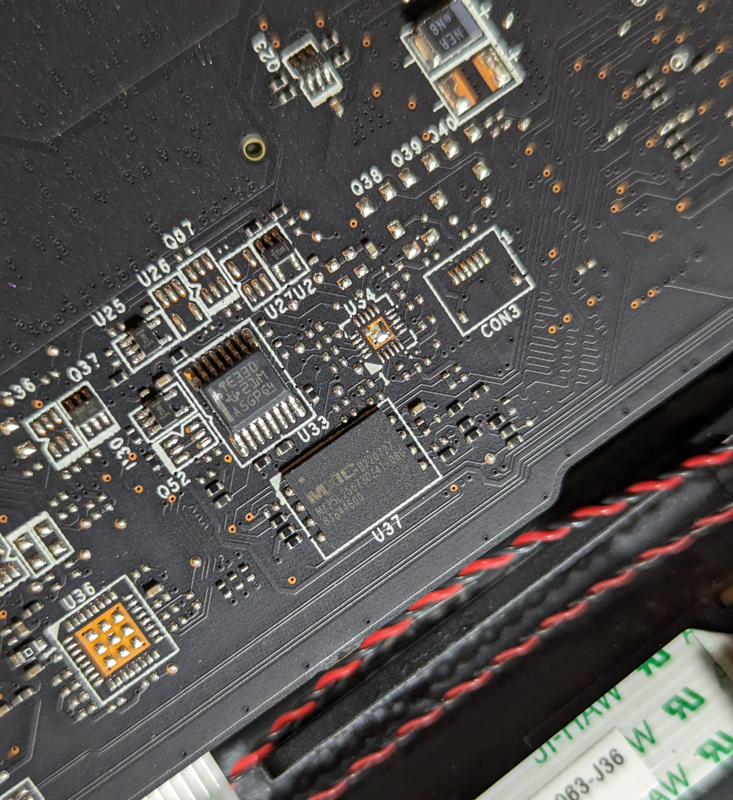
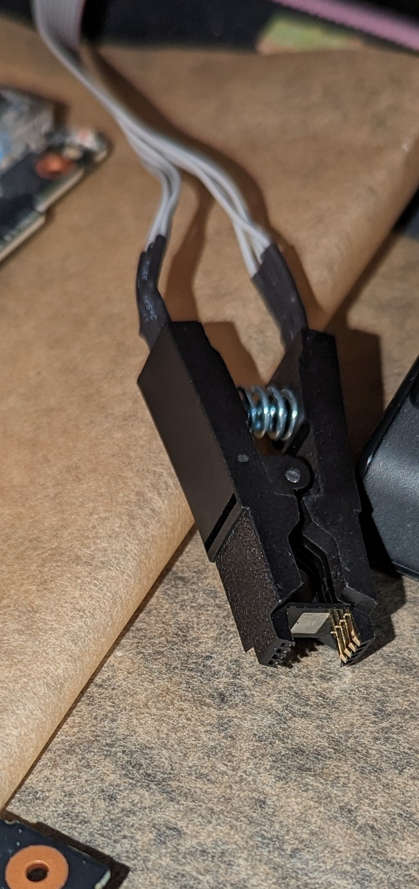
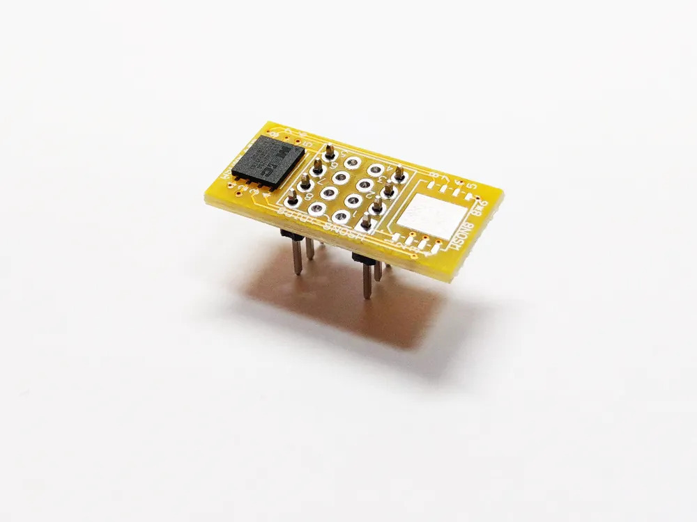
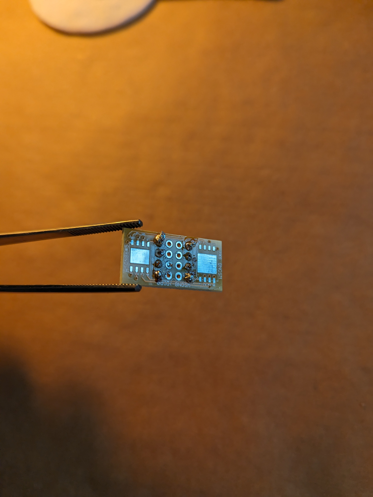
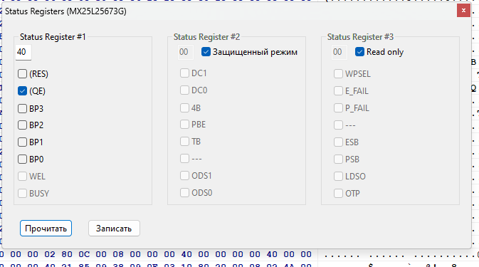
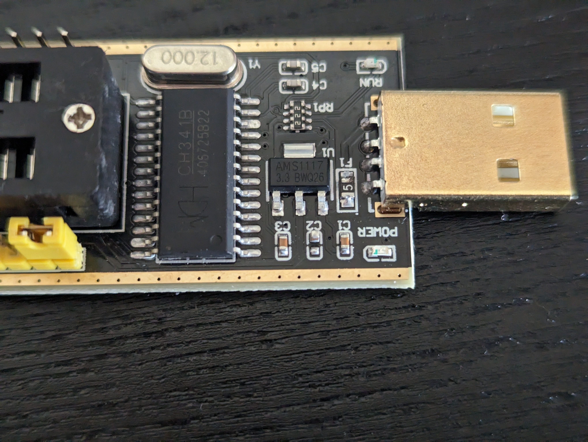
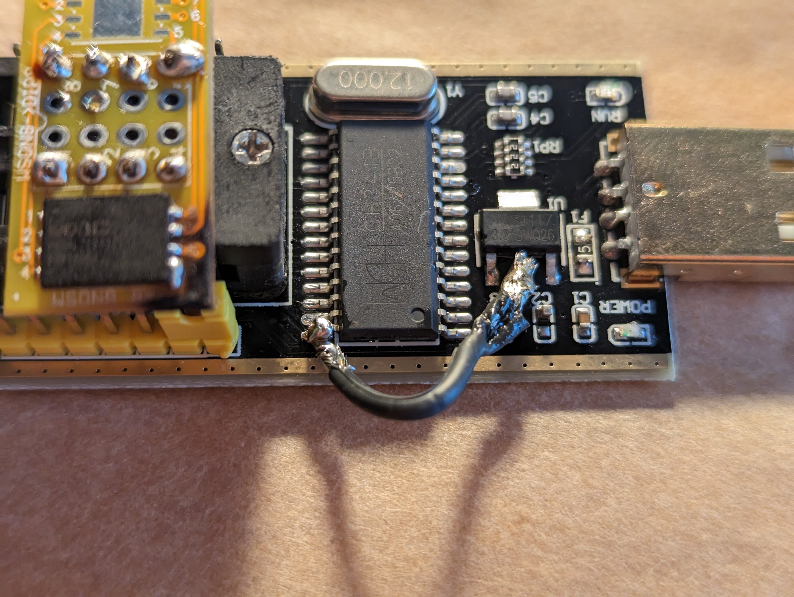
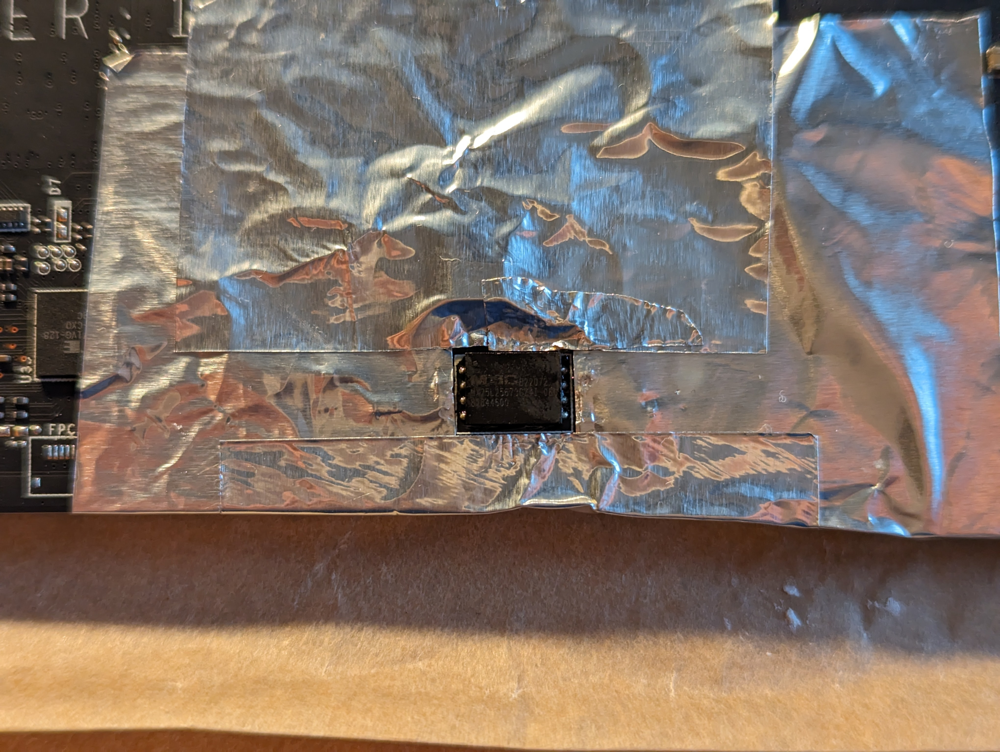
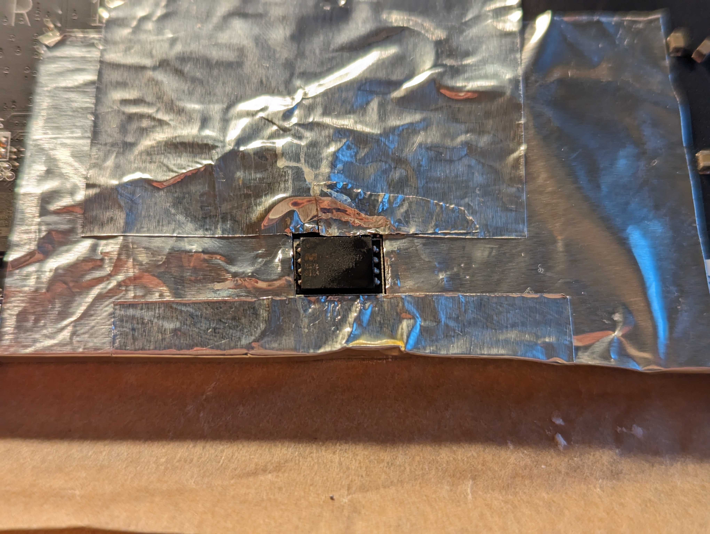
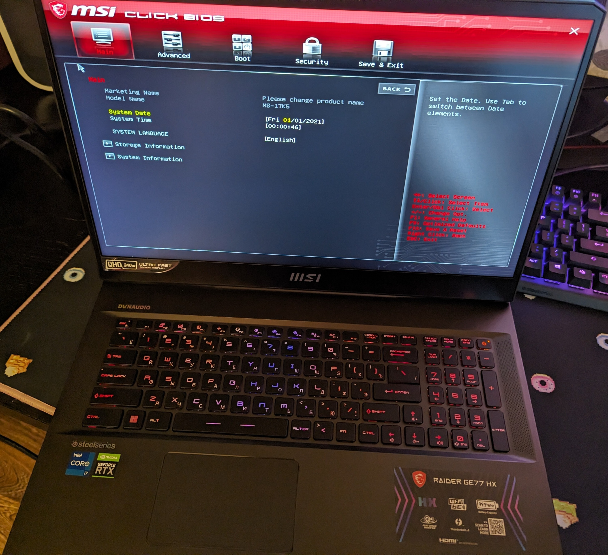

# 🛠️ BIOS Chip Firmware

## How I got into this situation
I tried to update my BIOS using the firmware from the MSI website, but my laptop shut off at 5% update. I suspected that the BIOS was damaged, and this was the cause of my laptop's failure to start.

## Symptoms:
- EC reset didn't help
- After turning on, the black screen hangs indefinitely

---

## Treatment

### Necessary tools
- Heat gun
- Solder
- Active flux
- Soldering iron
- CH341A programmer (may be on the CH341B chip, this is a new revision)
- QFN8/DFN8 chip adapter

---

## Story

I had to completely disassemble the laptop, the chip was on the opposite side of the motherboard (relative to the CPU and GPU).
<details>
<summary>BIOS Chip</summary>


</details>

Next, I attached aluminum foil around the BIOS chip
<details>
<summary>BIOS chip with foil</summary>


</details>
and soldered it off with a heat gun.

I tried to flash the chip via NeoProgrammer and the clip that came with the programmer - nothing worked. Don't do this!
<details>
<summary>Unsuccessful firmware attempt</summary>


</details>

I bought a QFN8/DFN8 chip adapter, soldered the chip on it.
<details>
<summary>Adapter with chip</summary>



</details>

But even after this, the chip didn't flash. Reading the chip after flashing returned a mess.

The registers looked like this
<details>
<summary>Registers</summary>


</details>

<details>
<summary>Program log</summary>

```log

Programmer, for MCU, AVR, SPI FLASH/EEPROM, I2C, Microwire,2.2.0.10 (15.10.2021)
chiplist.dat Version: 29.09.2021
---------------------------------------------------------------------------
Currently selected: MX25L25673G [3.3V] 256 Mbits, 32 Mbytes
---------------------------------------------------------------------------
Using programmer: CH341 Black
0:43:25
Erasing flash...
The process can take more than a minute on large flash drives!
Success
Execution time: 00:00:03.417
Using programmer: CH341 Black
0:43:37
Reading flash... Main Memory
Success
Execution time: 00:04:45.732
CRC32 = 0xEA0DDEFA
Done
Using programmer: CH341 Black
0:51:13
Reading flash... Main Memory
Success
Execution time: 00:04:47.578
CRC32 = 0xFE5CF682
Done
Protection Register was: 01000000(0x40),
Protection Register became: 01000000(0x40),

```
</details>


I needed to rework the programmer. [Rework guide](../../docs/guide_ch341_ru.pdf)
<details>
<summary>Programmer before and after rework</summary>



</details>

Then the chip was successfully flashed.

---

## You will need:
- NeoProgrammer
- Choose the MX25L25673G chip (I had the MX25L25673GZ4I-08G in my laptop)
- Firmware from the MSI website. An archive of versions is located [here](ipfs_link)

### Steps:
1. Dump the chip
2. Erase the chip
3. Choose the firmware file
4. Flash the firmware into the chip

---

Next, I had to solder the chip back onto the board and assemble the laptop, which I successfully did.
<details>
<summary>Chip before and after soldering</summary>



</details>

And the laptop turned on
<details>
<summary>Turned on laptop</summary>


</details>

Since I successfully erased my serial numbers, I needed to restore them.

[Continuation](sn_restore_ru.md).
